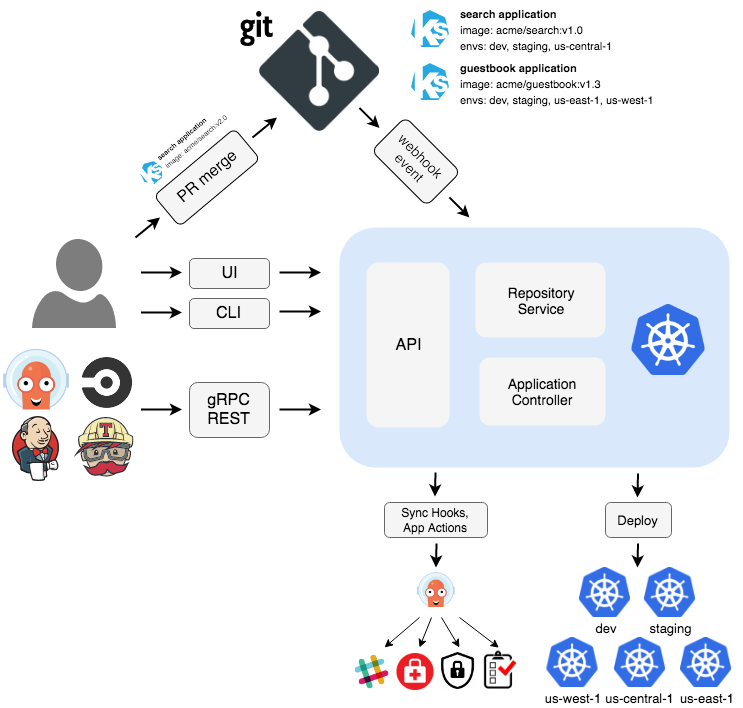

# Argo CD

Argo CD is a declarative, GitOps continuous delivery tool for Kubernetes.

Application definitions, configurations, and environments should be declarative and version controlled. Application deployment and lifecycle management should be automated, auditable, and easy to understand.

### Requirements

- Insstalled `kubectl`.
- Have a `kubeconfig` file (default location is ~/.kube/config).

## 1. Create k3d cluster

```
k3d cluster create asciiartify
```

How to create k3d cluster read in more detailed instruction [./Concept.md](./Concept.md#demo-k3d)

## 2. Install Argo CD

Run the following commands to install the Argo CD on a Kubernetes cluster:

```
kubectl create namespace argocd
kubectl apply -n argocd -f https://raw.githubusercontent.com/argoproj/argo-cd/stable/manifests/install.yaml
```

This will create a new namespace, `argocd`, where Argo CD services and application resources will live.

## 3. Get password

The default login for Argo CD is admin. To get the password, run the command:

```
kubectl -n argocd get secret argocd-initial-admin-secret -o jsonpath="{.data.password}" | base64 -d
```

## 4. Access to the Argo CD UI

You can use port-forwarding to access the Argo CD web interface:

```
kubectl port-forward svc/argocd-server -n argocd 8080:443
```

After that, open your browser and follow the link: [https://localhost:8080](https://localhost:8080). Use the admin login and the password received in the previous step to log in.

## Demo starting Argo CD


# Argo CD architecture overview



Argo CD is implemented as a Kubernetes controller which continuously monitors running applications and compares the current, live state against the desired target state (as specified in the Git repo). A deployed application whose live state deviates from the target state is considered OutOfSync. Argo CD reports & visualizes the differences, while providing facilities to automatically or manually sync the live state back to the desired target state. Any modifications made to the desired target state in the Git repo can be automatically applied and reflected in the specified target environments.

## Components

### API Server

The API server is a gRPC/REST server which exposes the API consumed by the Web UI, CLI, and CI/CD systems. It has the following responsibilities:

- application management and status reporting
- invoking of application operations (e.g. sync, rollback, user-defined actions)
- repository and cluster credential management (stored as K8s secrets)
- authentication and auth delegation to external identity providers
- RBAC enforcement
- listener/forwarder for Git webhook events

### Repository Server

The repository server is an internal service which maintains a local cache of the Git repository holding the application manifests. It is responsible for generating and returning the Kubernetes manifests when provided the following inputs:

- repository URL
- revision (commit, tag, branch)
- application path
- template specific settings: parameters, helm values.yaml

### Application Controller

The application controller is a Kubernetes controller which continuously monitors running applications and compares the current, live state against the desired target state (as specified in the repo). It detects OutOfSync application state and optionally takes corrective action. It is responsible for invoking any user-defined hooks for lifecycle events (PreSync, Sync, PostSync)
